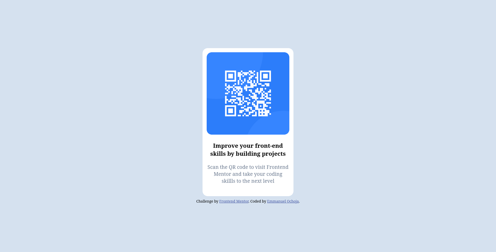

# Frontend Mentor - QR code component solution

This is a solution to the [QR code component challenge on Frontend Mentor](https://www.frontendmentor.io/challenges/qr-code-component-iux_sIO_H). Frontend Mentor challenges help you improve your coding skills by building realistic projects. 

## Table of contents

- [Overview](#overview)
  - [Screenshot](#screenshot)
  - [Links](#links)
- [My process](#my-process)
  - [Built with](#built-with)
  - [Useful resources](#useful-resources)
- [Author](#author)

## Overview
This is a qr-code card using HTML and CSS only. The image of the qr-code is embedded in the card with border radius given to the image and the card 

### Screenshot

### Links

- Solution URL: [Add solution URL here](https://your-solution-url.com)
- Live Site URL: [Add live site URL here](https://your-live-site-url.com)

## My process
I started with the semantic structure working on the HTML first, starting from the outermost container to the innermost content, begining with the card, then inserting the image, then adding the text content.

After that I proceeded to applying the css properties setting the image size, then the font-size, then the background color and font-color

### Built with

- Semantic HTML5 markup
- CSS
- Flexbox

### Useful resources

- [Centering items vertically on a page](https://stackoverflow.com/questions/25311541/how-to-vertically-align-text-inside-a-flexbox)- This stackoverflow resource was helpful in giving a very quick response to centering the card vertically using flexbox

## Author

- Website - [Emmanuel Ochoja](https://www.your-site.com)
- Frontend Mentor - [@yourusername](https://www.frontendmentor.io/profile/yourusername)
- Twitter - [@emmanuelochoja](https://www.twitter.com/yourusername)

